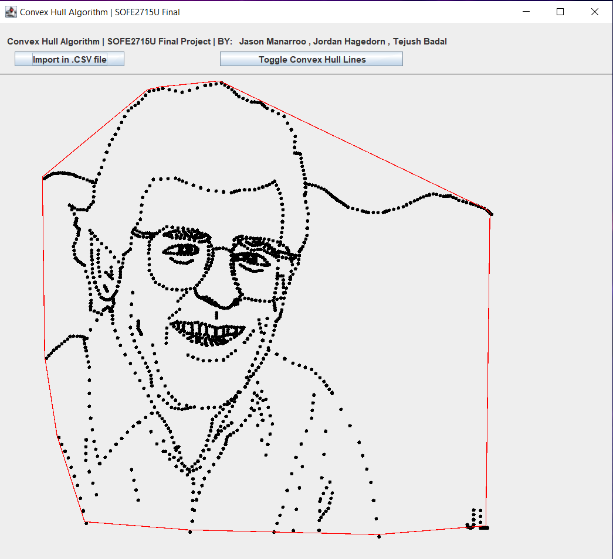

# Convex Hull Algorithm
### Data Structures (SOFE2715U) Final Project

*By: Jason Manarroo, Jordan Hagedorn & Tejush Badal*

Given **n** points on an X-Y scatter plot *(Ranging -VE to +VE Infinity on both axis)*, the Convex Hull algorithm essentially draws a circumference arround the points which encapsulates all of them. This algorithm is well known in the Computer Science world and is used in many emerging Machine Learning applications.

Screenshot of the Swing UI with `dataSet4.csv` loaded in:

- Implemented the Graham Scan recursive algorithm which iterates through the points, and tries to make CCW links with the next node, if it goes CW at one point, the algorithm will back-track and correct the path.

- For drawing to the GUI interface, the coordinates of different datasets had to be normalized to a specific **Width** by **Height** (The GUI Window's Size) whilst still keeping relative proportions.

- Use of JFrame *(Swing)* 's built-in Window utilites for Creation of Windows, Buttons, File Selections, Drawing API, etc...

<h2> Developpement Stack used for this project: </h2>

- Java 17
- Java Swing Library (Java AWT)

**Grade Received** : *A+*  :-D

